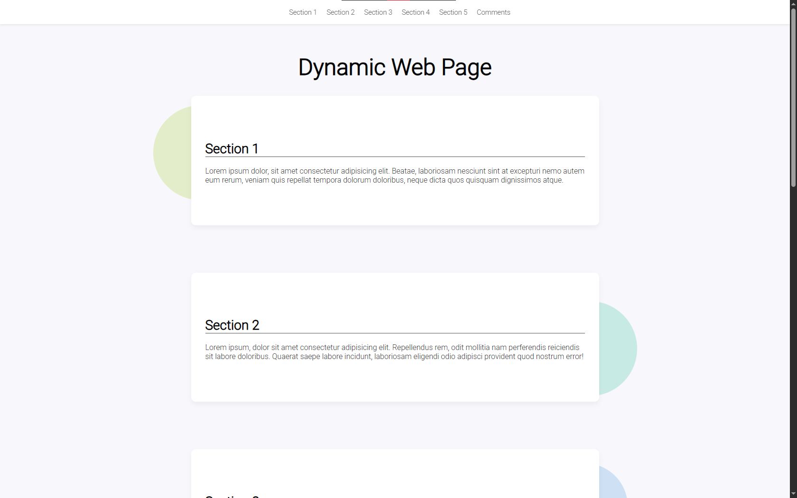

# Dynamic Web Page 🌐

This is a fully responsive and interactive dynamic web page built using HTML, CSS, and JavaScript. The goal of the project is to create a modern website structure that includes dynamic navigation, smooth scrolling, active section highlighting, and a functional comment form with validation.

## 🚀 Skills Needed

- HTML5 basic understanding & semantic tags
- CSS including Flexbox & Media Queries
- JavaScript DOM
- JavaScript event listeners
- Form validation using JavaScript
- Responsive design techniques
- Web development best practices

## 📂 Project Structure

- Dynamic_Landing_Page_Project/
- ├── assets/
- │ └── images/
- │ └── icon.png
- ├── scripts/
- │ └── script.js
- ├── styles/
- │ └── style.css
- ├── index.html
- └── README.md

## 📸 Preview

